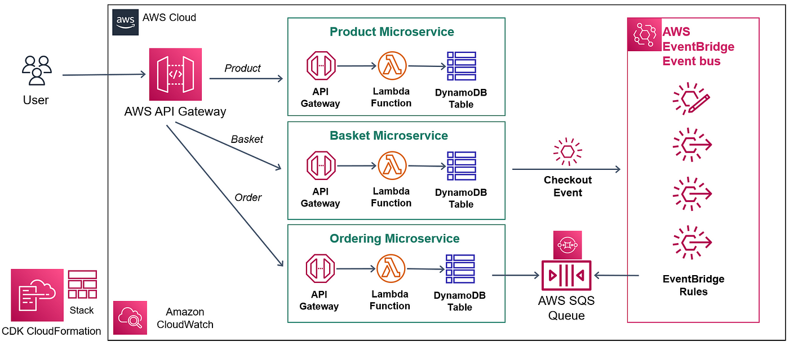

# Well-Architected Serverless Application

A demonstration of AWS serverless best practices showcasing:

- Microservices architecture with independent Lambda functions
- Event-driven design using SNS, SQS, and EventBridge
- Security best practices with IAM least privilege and API Gateway auth
- Infrastructure as Code with AWS SAM/CloudFormation and Terraform

## Architecture Overview



## Features

- **Microservices**: Independent Lambda functions for each business capability
- **Event-Driven**: Asynchronous processing with SNS/SQS and EventBridge
- **Security**: IAM roles with least privilege, API Gateway authentication
- **IaC**: Deployable with AWS SAM or Terraform
- **CI/CD**: GitHub Actions pipeline for automated deployment

## Getting Started

### Prerequisites

- AWS account with appropriate permissions
- AWS CLI configured
- Node.js (for Lambda functions)
- AWS SAM CLI (if using SAM) or Terraform

### Deployment

#### Using AWS SAM

```bash
sam build
sam deploy --guided